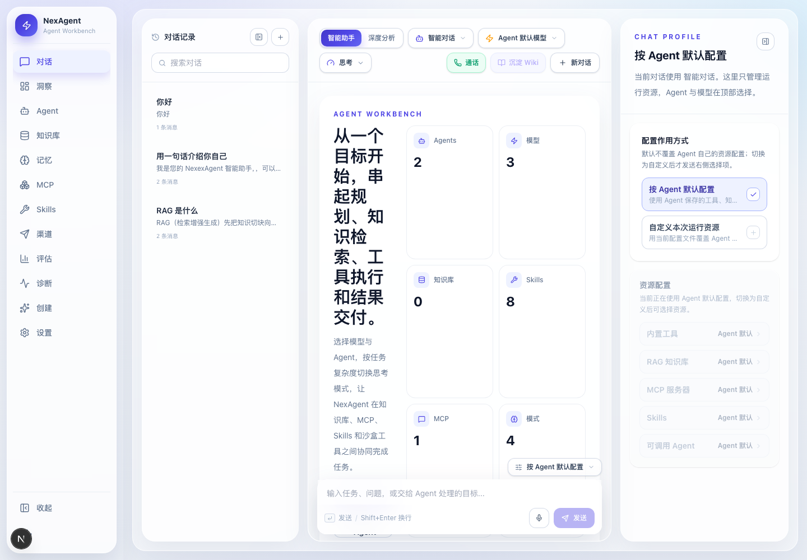
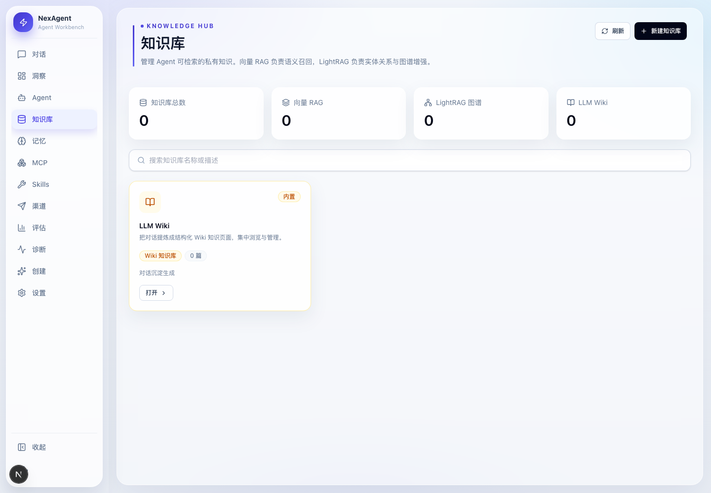
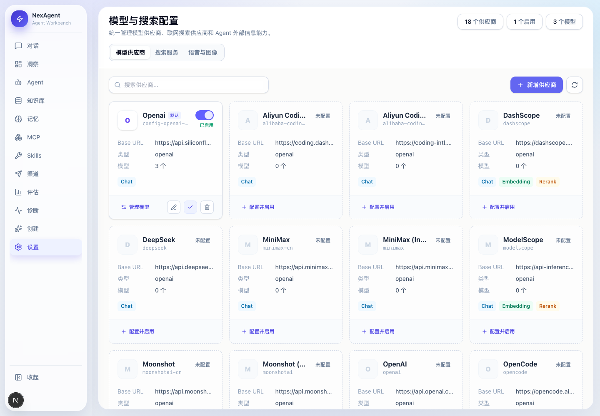
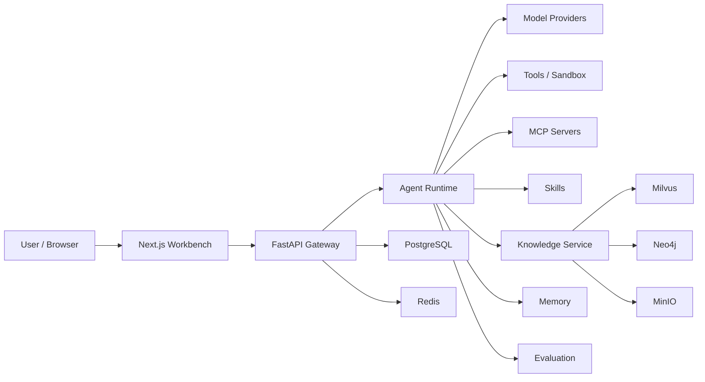

<div align="center">

# ⚡ NexAgent

**An AI agent workbench for local-first and private deployments.**

NexAgent brings chat, deep research, RAG, knowledge graphs, MCP, Skills, memory, evaluation, model configuration, and sandboxed tools into one runnable and extensible open-source project.

English · [简体中文](README.md)

[](LICENSE)
[](backend/pyproject.toml)
[](https://github.com/sxxss/NexAgent/actions/workflows/ci.yml)
[](#-local-development)
[](#-local-development)
[](#-how-it-works)
[](#-screenshots)
[](#-contributing)

[Quick Start](#-quick-start) · [Screenshots](#-screenshots) · [Configure Models](#-configure-models) · [How It Works](#-how-it-works) · [Layout](#-layout)

<br/>



<sub>Start from a goal, choose the model and agent, switch reasoning modes by task complexity, and let NexAgent coordinate knowledge bases, MCP, Skills, and sandboxed tools.</sub>

</div>

---

## ✨ What Makes It Different

| | |
|---|---|
| 🧠 **An agent is more than a chat box** | Every run can explicitly choose the model, tools, knowledge bases, MCP servers, Skills, callable agents, and reasoning mode. |
| 📚 **RAG and knowledge graphs in one workflow** | Upload, parse, chunk, embed, rerank, cite sources, and connect to Neo4j / LightRAG graph capabilities. |
| 🔌 **MCP and Skills are first-class** | Install, manage, edit, and test MCP servers and Skills from the same workbench. |
| 🧪 **Usage and evaluation in one loop** | Built-in eval suites, knowledge regression, invocation logs, cost tracking, token anomaly repair, and diagnostics. |
| 🧰 **Local-first and transparent** | Secrets stay in `.env`, runtime config stays in `config.yaml`, local data stays in `.nexagent/`, and the repository keeps only safe templates and source code. |

> NexAgent is currently in the v0.x stage. The core workbench, agent runtime, knowledge base, model settings, MCP, Skills, and evaluation flows are in place; production deployments should still harden networking, provider credentials, and data security.

## 🖼️ Screenshots

| Agent Workbench | Knowledge Hub | Model Settings |
|:---:|:---:|:---:|
|  |  |  |

## 🚀 Quick Start

### 1. Prepare Configuration

```bash
git clone https://github.com/sxxss/NexAgent.git
cd NexAgent

cp .env.example .env
cp config.example.yaml config.yaml
```

Add at least one model provider key to `.env`, for example:

```bash
SILICONFLOW_API_KEY=...
OPENAI_API_KEY=...
ANTHROPIC_API_KEY=...
GOOGLE_API_KEY=...
```

### 2. Start the Backend and Infrastructure

```bash
docker compose up -d postgres redis gateway
```

Backend endpoints:

- API: `http://localhost:8001`
- OpenAPI docs: `http://localhost:8001/docs`
- Readiness check: `http://localhost:8001/health/ready`

### 3. Start the Frontend

```bash
cd frontend
npm install
npm run dev
```

Open `http://localhost:3000`.

## 📚 Enable the Knowledge Stack

The default startup only includes PostgreSQL, Redis, and the Gateway. For vector retrieval, production knowledge bases, and graph features, start the knowledge profile:

```bash
docker compose --profile kb up -d
```

This adds:

| Service | Purpose |
|---|---|
| Milvus | Vector index and semantic retrieval |
| MinIO | Object storage for uploaded files, parsed text, and index manifests |
| etcd | Milvus dependency |
| Neo4j | Knowledge graph and relationship retrieval |

> The default Compose credentials are for local development only. Replace database, MinIO, Neo4j, and model-provider secrets before exposing services or deploying to production.

## 🔌 Configure Models

NexAgent is not tied to a single model provider. Use the `Settings / Model & Search Configuration` page to manage providers, models, embedding, rerank, speech, image, and web-search capabilities.

<table>
<tr><th>Capability</th><th>Description</th></tr>
<tr>
<td><b>Chat / Reasoning</b></td>
<td>OpenAI-compatible endpoints are supported, with provider types reserved for Anthropic, Google, Ollama, and others. Different agents can use different default models.</td>
</tr>
<tr>
<td><b>Embedding / Rerank</b></td>
<td>Knowledge bases can choose embedding models, dimensions, and rerank models independently for Milvus-backed retrieval.</td>
</tr>
<tr>
<td><b>Web Search</b></td>
<td>Supports DuckDuckGo, Tavily, Brave, SerpAPI, Bing, Exa, SearXNG, and fetch/search configuration.</td>
</tr>
<tr>
<td><b>Speech / Image</b></td>
<td>ASR, TTS, and image generation use OpenAI-compatible HTTP APIs, making cloud and self-hosted services easy to plug in.</td>
</tr>
</table>

## ⚙️ How It Works

NexAgent is built from a FastAPI Gateway, a Next.js workbench, and local/containerized infrastructure. The frontend handles configuration and user experience; the backend orchestrates agents, models, tools, knowledge, MCP, Skills, memory, and evaluation.



A typical agent run goes through:

| Stage | What happens |
|---|---|
| `profile` | Choose agent, model, reasoning mode, tools, knowledge bases, MCP servers, and Skills |
| `context` | Assemble chat history, memory, retrieved knowledge, and runtime constraints |
| `reasoning` | Call the model and optionally enter thinking, planning, tool calls, or sub-agent delegation |
| `tooling` | Run built-in tools, MCP tools, sandboxed code, web search, or knowledge retrieval |
| `streaming` | Stream thinking, tool calls, research steps, artifacts, and errors to the frontend over SSE |
| `evaluation` | Feed samples, knowledge questions, and run results into regression evaluation |

## 📂 Layout

```text
backend/
  app/gateway/             FastAPI app, API routers, auth, and health checks
  packages/core/nexagent/  Agent runtime, models, knowledge, tools, MCP, DB, services
  tests/                   Backend unit tests and phase verification

frontend/
  src/app/                 Next.js pages: chat, knowledge, MCP, Skills, eval, settings
  src/components/          Workbench components, chat components, base UI
  src/lib/                 API client, state store, utilities

skills/
  public/                  Public Skills distributed with the repository
  custom/                  Local custom Skills slot; user content is ignored by default

docker/                    Sandbox execution image
scripts/                   Setup, diagnostics, migration, and verification scripts
docs/images/               README screenshots and visual assets
```

## 🛠️ Local Development

### Backend

```bash
cd backend
uv sync
uv run uvicorn app.gateway.app:app --host 0.0.0.0 --port 8001 --reload
```

Common checks:

```bash
cd backend
uv run ruff check .
uv run pytest
```

### Frontend

```bash
cd frontend
npm install
npm run dev
```

Common checks:

```bash
cd frontend
npm run lint
npm run build
```

## 🧾 What Should Be Committed

Commit:

- Source code under `backend/`, `frontend/src/`, `scripts/`, and `docker/`
- Tests under `backend/tests/`
- Public reusable Skills under `skills/public/`
- Safe templates such as `.env.example`, `config.example.yaml`, and `docker-compose.yml`
- Active package-manager lock files such as `backend/uv.lock` and `frontend/package-lock.json`
- Visual assets under `docs/images/` used by README and docs

Keep local:

- `.env`, `config.yaml`
- `.nexagent/`, local databases, runtime artifacts, generated secrets
- `node_modules/`, `.next/`, `.venv/`, caches, and test artifacts
- IDE state, personal agent configuration, and user-created `skills/custom/*`

## ⚠️ Known Limitations

- **Model quality sets the ceiling.** Complex reasoning, long-document retrieval, and multi-step tool use depend heavily on the selected model and context window.
- **The knowledge stack depends on infrastructure.** Milvus, MinIO, and Neo4j connections, dimensions, and index settings must match your model configuration.
- **The local sandbox is not a production isolation boundary.** For untrusted code, use container isolation and restrict mounts, networking, and permissions.
- **v0.x APIs may still change.** Database schema, frontend pages, and some service contracts are still evolving quickly.

## 🤝 Contributing

Issues, pull requests, documentation improvements, new Skills, and MCP integrations are welcome. Good first contribution areas include:

- New model provider templates
- Better document parsers and graph import workflows
- MCP server adapters and tool permission policies
- Agent evaluation samples, regression benchmarks, and diagnostics
- README, screenshots, deployment docs, and open-source examples

## 📄 License

NexAgent is released under the [MIT License](LICENSE). Some bundled Skills or assets keep their own license notices; see [THIRD_PARTY_NOTICES.md](THIRD_PARTY_NOTICES.md).

Model, search, speech, image, and external MCP services are configured by the user. Review your provider terms, data-compliance requirements, and deployment environment before production use.
