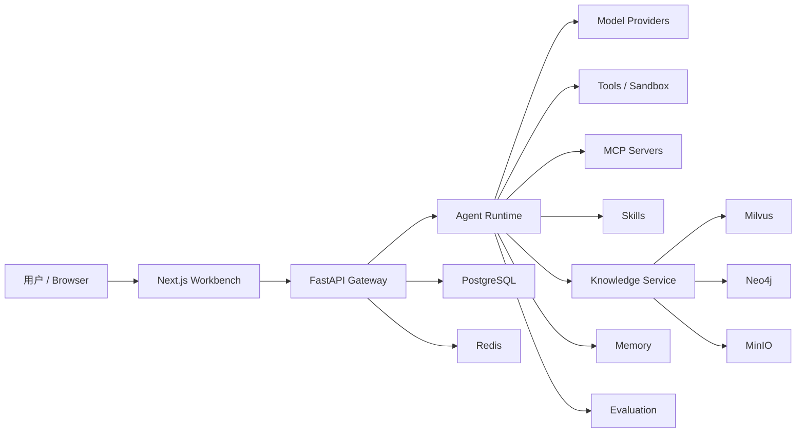

<div align="center">

# ⚡ NexAgent

**面向本地与私有化场景的 AI Agent 工作台。**

把对话、深度研究、RAG 知识库、知识图谱、MCP、Skills、记忆、评测、模型配置和沙盒工具统一到一个可运行、可扩展、可开源协作的工程里。

[English](README.en.md) · 简体中文

[](LICENSE)
[](backend/pyproject.toml)
[](https://github.com/sxxss/NexAgent/actions/workflows/ci.yml)
[](#-本地开发)
[](#-本地开发)
[](#-工作原理)
[](#-界面截图)
[](#-参与贡献)

[快速开始](#-快速开始) · [界面截图](#-界面截图) · [配置模型](#-配置模型) · [工作原理](#-工作原理) · [项目结构](#-项目结构)

<br/>


<sub>从一个目标开始，选择模型与 Agent，按任务复杂度切换思考模式，让 NexAgent 在知识库、MCP、Skills 和沙盒工具之间协同完成任务。</sub>

</div>

---

## ✨ 有什么不一样

| | |
|---|---|
| 🧠 **Agent 不是一个聊天框** | 每次运行都能选择模型、工具、知识库、MCP、Skills、可调用 Agent 和思考模式，把运行资源显式交给用户控制。 |
| 📚 **RAG 和知识图谱放在同一个工作流里** | 支持文档上传、解析、切分、向量索引、Rerank、来源证据和 Neo4j / LightRAG 图谱能力。 |
| 🔌 **MCP 与 Skills 都是一等能力** | 可以安装、管理和测试 MCP 服务，也可以维护内置、公开、自定义或 GitHub 来源的 Skills。 |
| 🧪 **从使用到评测闭环** | 内置评测集、知识库回归、调用日志、成本统计、异常 token 修复和诊断页，方便持续改 Agent。 |
| 🧰 **本地优先，配置透明** | 密钥放在 `.env`，运行配置放在 `config.yaml`，本地数据放在 `.nexagent/`，仓库只提交安全模板和源码。 |

> 当前处于 v0.x 阶段：核心工作台、Agent 运行、知识库、模型配置、MCP、Skills 和评测流程已经成型；生产部署前仍建议根据自己的网络、模型供应商和数据安全要求做配置加固。

## 🖼️ 界面截图

| Agent Workbench | Knowledge Hub | Model Settings |
|:---:|:---:|:---:|
|  |  |  |

## 🚀 快速开始

### 1. 准备配置

```bash
git clone https://github.com/sxxss/NexAgent.git
cd NexAgent

cp .env.example .env
cp config.example.yaml config.yaml
```

在 `.env` 里填入至少一个模型供应商密钥，例如：

```bash
SILICONFLOW_API_KEY=...
OPENAI_API_KEY=...
ANTHROPIC_API_KEY=...
GOOGLE_API_KEY=...
```

### 2. 启动后端和基础设施

```bash
docker compose up -d postgres redis gateway
```

后端 API 地址：

- API: `http://localhost:8001`
- OpenAPI 文档: `http://localhost:8001/docs`
- 健康检查: `http://localhost:8001/health/ready`

### 3. 启动前端

```bash
cd frontend
npm install
npm run dev
```

打开 `http://localhost:3000`。

## 📚 启用知识库能力

默认启动只包含 PostgreSQL、Redis 和 Gateway。要使用向量检索、生产知识库和图谱能力，启动知识库 profile：

```bash
docker compose --profile kb up -d
```

这会额外启动：

| 服务 | 用途 |
|---|---|
| Milvus | 向量索引与语义检索 |
| MinIO | 上传文件、解析结果和索引 manifest 的对象存储 |
| etcd | Milvus 依赖 |
| Neo4j | 知识图谱与关系检索 |

> Compose 中的默认密码只适合本地开发。对外暴露服务或部署到生产环境前，请替换数据库、MinIO、Neo4j 和模型供应商密钥。

## 🔌 配置模型

NexAgent 不绑定某一家模型服务。你可以在 `设置 / 模型与搜索配置` 页面维护供应商、模型、Embedding、Rerank、语音、图像和联网搜索能力。

<table>
<tr><th>能力</th><th>说明</th></tr>
<tr>
<td><b>Chat / Reasoning</b></td>
<td>支持 OpenAI 兼容接口，也预留 Anthropic、Google、Ollama 等 provider 类型。可以给不同 Agent 配默认模型。</td>
</tr>
<tr>
<td><b>Embedding / Rerank</b></td>
<td>知识库可独立选择 Embedding 模型、维度和 Rerank 模型，适配 Milvus 检索链路。</td>
</tr>
<tr>
<td><b>Web Search</b></td>
<td>支持 DuckDuckGo、Tavily、Brave、SerpAPI、Bing、Exa、SearXNG 等搜索/抓取配置。</td>
</tr>
<tr>
<td><b>Speech / Image</b></td>
<td>ASR、TTS 和图像生成走 OpenAI 兼容 HTTP 接口，便于接入云端或自建服务。</td>
</tr>
</table>

## ⚙️ 工作原理

NexAgent 由一个 FastAPI Gateway、一个 Next.js 工作台和一组本地/容器化基础设施组成。前端负责配置和运行体验；后端负责编排 Agent、模型、工具、知识库、MCP、Skills、记忆和评测。



一次典型的 Agent 调用会经历：

| 阶段 | 做什么 |
|---|---|
| `profile` | 选择 Agent、模型、思考模式、工具、知识库、MCP 和 Skills |
| `context` | 装配历史对话、记忆、知识库检索结果和运行约束 |
| `reasoning` | 调用模型，按需进入思考、规划、工具调用或子 Agent 分派 |
| `tooling` | 执行内置工具、MCP 工具、沙盒代码、联网搜索或知识检索 |
| `streaming` | 用 SSE 把思考、工具调用、研究步骤、产物和错误实时推给前端 |
| `evaluation` | 可将样本、知识库问题和运行结果纳入回归评测 |

## 📂 项目结构

```text
backend/
  app/gateway/             FastAPI 入口、API routers、鉴权与健康检查
  packages/core/nexagent/  Agent runtime、模型、知识库、工具、MCP、DB、服务层
  tests/                   后端单元测试和阶段验证

frontend/
  src/app/                 Next.js 页面：对话、知识库、MCP、Skills、评测、设置等
  src/components/          工作台组件、聊天组件、基础 UI
  src/lib/                 API client、状态管理和工具函数

skills/
  public/                  随仓库分发的公共 Skills
  custom/                  本地自定义 Skills 插槽，默认不提交用户内容

docker/                    沙盒执行镜像
scripts/                   安装、诊断、迁移和阶段验证脚本
docs/images/               README 截图与展示资源
```

## 🛠️ 本地开发

### 后端

```bash
cd backend
uv sync
uv run uvicorn app.gateway.app:app --host 0.0.0.0 --port 8001 --reload
```

常用检查：

```bash
cd backend
uv run ruff check .
uv run pytest
```

### 前端

```bash
cd frontend
npm install
npm run dev
```

常用检查：

```bash
cd frontend
npm run lint
npm run build
```

## 🧾 应该提交什么

建议提交：

- `backend/`、`frontend/src/`、`scripts/`、`docker/` 等源码
- `backend/tests/` 测试
- `skills/public/` 中可公开复用的 Skills
- `.env.example`、`config.example.yaml`、`docker-compose.yml` 等安全模板
- `backend/uv.lock`、`frontend/package-lock.json` 等当前包管理器锁文件
- `docs/images/` 中用于 README 和文档的展示截图

不要提交：

- `.env`、`config.yaml`
- `.nexagent/`、本地数据库、运行产物、生成密钥
- `node_modules/`、`.next/`、`.venv/`、缓存和测试产物
- IDE 状态、个人 Agent 配置、`skills/custom/*` 用户内容

## ⚠️ 已知限制

- **模型质量决定上限。** 复杂推理、长文档检索和多步工具调用的效果取决于所选模型与上下文窗口。
- **知识库链路依赖基础设施。** Milvus、MinIO、Neo4j 的连接、维度和索引配置需要和模型配置匹配。
- **本地沙盒不是生产隔离方案。** 对不可信代码执行有更高要求时，请使用容器隔离并收紧挂载目录、网络和权限。
- **v0.x API 仍可能调整。** 数据库 schema、前端页面和部分服务接口仍处于快速迭代阶段。

## 🤝 参与贡献

欢迎提交 issue、PR、文档改进和新的 Skills / MCP 集成。比较适合优先贡献的方向：

- 新模型供应商模板
- 更完整的知识库解析器和图谱导入流程
- MCP server 适配和工具权限策略
- Agent 评测样本、回归基准和诊断脚本
- README、截图、部署文档和开源示例

## 📄 依赖与许可

NexAgent 以 [MIT License](LICENSE) 开源。部分随仓库分发的 Skills 或素材保留自己的许可说明，详见 [THIRD_PARTY_NOTICES.md](THIRD_PARTY_NOTICES.md)。

模型、搜索、语音、图像和外部 MCP 服务由使用者自行接入；请根据你的供应商条款、数据合规要求和部署环境进行配置。
